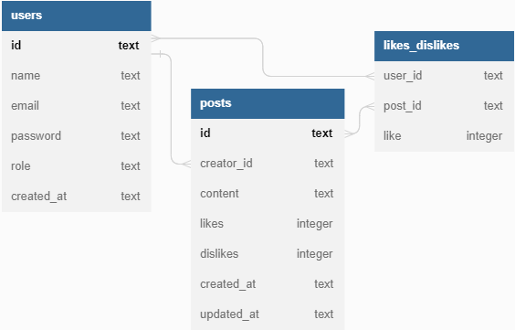

# Projeto - Labook - backend
#

O **Labook** é uma rede social com o objetivo de promover a conexão e interação entre pessoas. Quem se cadastrar no aplicativo poderá criar e curtir publicações.

##

**API para aplicação de gestão de projetos.**

*Aplicação banck-end de servidor express com banco de dados SQL SQlite 3.*

#
## Stack utilizada: Front-end: 
* NodeJS 

* Typescript

* Express

* SQL e SQLite

* Knex

* POO

* Arquitetura em camadas

* Geração de UUID

* Geração de hashes 

* Autenticação e autorização

* Roteamento

* Postman

#

# Banco de dados

# Requisitos:
<table>

  <tr>
    <th>Endpoints</th> 
    <td></td>
    <th>Autenticação e Autorização</th>
     <td></td>
    <th>Código</th>   
    </tr>
  <tr>
    <td> signup </td>
     <td></td>
    <td> identificação UUID</td>
     <td></td>
    <td>POO</td>
     <td></td>
  </tr>
  <tr>
    <td> login</td>
     <td></td>
    <td> senhas hasheadas com Bcrypt </td>
     <td></td>
    <td>Arquitetura em camadas</td>
     <td></td>
  </tr>
  <tr>
    <td> get posts</td>
     <td></td>
    <td> tokens JWT </td>
     <td></td>
    <td>Roteadores no Express</td>     
      <td></td>
  </tr>  

  <tr>
    <td>  create post</td>
    <td></td>  
  </tr>
  <tr>
    <td>  edit post</td>
    <td></td>  
  </tr>
  <tr>
    <td>   delete post</td>
    <td></td>
    </tr>
  <tr>
    <td>Like / dislike post
</td>
    <td></td>
  </tr>
</table>

#
#
## Exemplos de requisição

* Signup
Endpoint público utilizado para cadastro. Devolve um token jwt.
* Login
Endpoint público utilizado para login. Devolve um token jwt.
* Get posts
Endpoint protegido, requer um token jwt para acessá-lo.
* Create post
Endpoint protegido, requer um token jwt para acessá-lo.
* Edit post
Endpoint protegido, requer um token jwt para acessá-lo.
Só quem criou o post pode editá-lo e somente o conteúdo pode ser editado.
* Delete post
Endpoint protegido, requer um token jwt para acessá-lo.
Só quem criou o post pode deletá-lo. Admins podem deletar o post de qualquer pessoa.
* Like or Dislike post (mesmo endpoint faz as duas coisas)
Endpoint protegido, requer um token jwt para acessá-lo.
Quem criou o post não pode dar like ou dislike no mesmo.
Caso dê um like em um post que já tenha dado like, o like é desfeito.
Caso dê um dislike em um post que já tenha dado dislike, o dislike é desfeito.
Caso dê um like em um post que tenha dado dislike, o like sobrescreve o dislike.
Caso dê um dislike em um post que tenha dado like, o dislike sobrescreve o like.

* Para entender a tabela likes_dislikes
no SQLite, lógicas booleanas devem ser controladas via 0 e 1 (INTEGER) quando like valer 1 na tabela é porque a pessoa deu like no post 
na requisição like é true
quando like valor 0 na tabela é porque a pessoa deu dislike no post 
na requisição like é false
caso não exista um registro na tabela de relação, é porque a pessoa não deu like nem dislike 
caso dê like em um post que já tenha dado like, o like é removido (deleta o item da tabela)
caso dê dislike em um post que já tenha dado dislike, o dislike é removido (deleta o item da tabela)

## (Visualize a documentação)

https://documenter.getpostman.com/view/24460719/2s93CGRaxA

#

## Como rodar este projeto?

* Terminal bash
* Clone este repositório
git clone ...link do repo AQUI

* Acesse a pasta do projeto no seu terminal, ex: cd projeto-labook

* INSTALE AS DEPENDÊNCIAS: 

* *npm install:*  Instala todas as dependências listadas no package.json;
* *npm i cors:*  biblioteca para liberar acesso externo ao servido;
* *npm i express:*  framework para criar o servidor (API);
* *npm i knex:*  biblioteca query builder para conectar com banco de dados
* *npm i sqlite3:*  biblioteca do banco de dados SQLite
* *npm install uuid:*   tipagens, dependência de produção
* npm install -D @types/uuid:*  dependência de desenvolvimento
* *npm install dotenv:*  dependência de produção
* *npm install jsonwebtoken:*  dependência de produção, para facilitar a gestão de tokens
* *npm install -D @types/jsonwebtoken:* tipagens, dependência de desenvolvimento
* *npm i --save-dev @types/bcryptjs:* dependência de desenvolvimento

#
## Execute a aplicação

rodar o script de dev (npm run dev) ou rodar ou buildar o (npm run start).

 Servidor rodando na porta  3003. 
#
#

## 🚀 Sobre mim
 *Olá, me chamo Aureana!👋 Eu sou uma pessoa desenvolvedora full-stack, apaixonada por tecnologia!* 😊

 💖💖💖*Designed and built by Aureana with Love & Coffee*💖💖💖
#
#

## 🔗 Links

